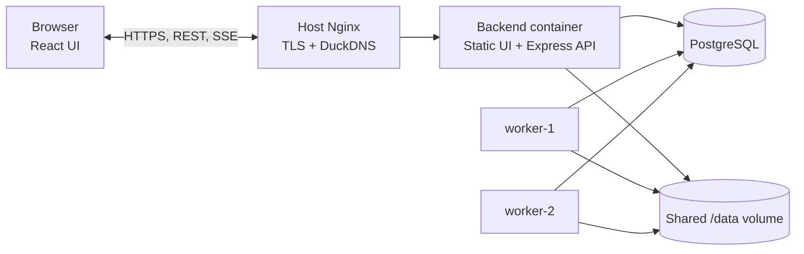

# Architecture

## Overview

Dilamme separates request handling from background execution. The backend
container serves the built React UI and the Express API, while independent
worker processes poll PostgreSQL for work. PostgreSQL is the source of truth
for job state, ownership, dependencies, logs, and worker health.

The local zero-setup mode uses an in-process PGlite database and worker. The
multi-worker and production topologies use PostgreSQL because workers must
coordinate through one shared, durable database.

## Topology



Nginx is the public edge. It terminates HTTPS and proxies the DuckDNS hostname
to the backend container. The backend and both workers mount the same `/data`
volume so a workflow step can consume an artifact created by another worker.

## Job Lifecycle

The public lifecycle has five states:

```text
pending -> processing -> completed
                      -> failed
                      -> cancelled
pending ----------------> cancelled
```

A failed execution with retries remaining returns the job to `pending` with a
future `scheduled_at`; there is no separate retrying state. A pending job can
be cancelled immediately. Cancellation during processing is cooperative and
is checked between handler steps and before the completion write.

## Scheduling And Ownership

Each worker poll first recovers expired leases, then fetches jobs that are
`pending`, due, and no longer blocked by dependencies. It builds a fresh
binary min-heap for that candidate batch. Rebuilding is intentional because
effective priority changes as jobs wait.

The heap key is
`[effective_priority, scheduled_at, created_at, job_id]`, with the lowest
tuple processed first. Effective priority improves by one level for every five
minutes a job has been eligible, down to priority 1. Aging begins at the later
of `created_at` and `scheduled_at`, so future jobs cannot gain priority before
they are due.

The heap controls order, but PostgreSQL controls ownership. A worker claims a
job with one conditional
`UPDATE ... WHERE status='pending' ... RETURNING` statement. If two workers
select the same candidate, only the worker whose update still sees `pending`
receives the row; the other skips it. This atomic claim is the duplicate
protection boundary.

## Failure Handling

`retry_count` records failed executions. With `max_retries = 3`, a job can run
up to four times: the initial execution followed by retries based on 1, 5, and
25 second delays, each with plus or minus 25 percent jitter. The fourth failure
sets the job to `failed` and places it in the dead-letter queue.

Claims use a time-limited lease. If a worker exits while processing, the lease
reaper moves the expired job from `processing` back to `pending` without
consuming a retry. This provides crash recovery but also means delivery is
at-least-once. Handlers therefore use deterministic paths and idempotent
side-effect guards.

The active dead-letter count has an alert threshold of five. The alert is
armed below the threshold, fires once when the count reaches five or more, and
re-arms only after the count drops below five. The armed state is stored in
`app_flags`, so repeated failures do not create an alert storm.

## Recurring Jobs

A successful recurring job creates one successor. Its next
`scheduled_at` is the previous scheduled time plus the configured interval,
clamped to the current time when the schedule has fallen behind. The system
does not create backfill runs, and creating the successor after completion
prevents overlapping runs. Failure or cancellation stops the recurrence chain.

## DAG Workflows

Workflow creation validates dependency graphs with Kahn's topological-sort
algorithm. Duplicate aliases, unknown dependencies, self-dependencies, and
cycles are rejected before rows are inserted.

At execution time, the candidate query excludes a job until every row in
`job_dependencies` points to a completed predecessor. Handler results are
stored on the job, allowing later steps to use earlier output. The included
report, upload, and email handlers mock external services while performing
real work: writing a report, copying it into a mock bucket, and appending an
email record under the shared `/data` volume.

## Live Updates

Workers write lifecycle events to `job_logs`. The backend SSE endpoint polls
that table by increasing log ID and sends new rows to connected browsers about
once per second. This keeps workers independent from the API process and lets
clients resume from an event cursor. Nginx disables buffering on the SSE route
in production.

## Scheduler Alternative

The timing-wheel implementation uses 60 one-second slots, an overflow list for
jobs beyond one rotation, and effective-priority sorting within each due
bucket. Slot insertion is constant time, but timing is slot-granular and
far-future jobs require overflow bookkeeping. The heap remains the default
because it provides exact priority and timestamp ordering. Real benchmark
numbers and the comparison methodology are in
[benchmark_results.md](benchmark_results.md).

## Schema

| Table | Purpose |
| --- | --- |
| `jobs` | Payload, priority, lifecycle state, schedule, retries, lease, result, recurrence, cancellation, and workflow links. |
| `job_dependencies` | Directed edges between a job and each prerequisite. |
| `job_logs` | Structured lifecycle events and the source for SSE updates. |
| `dead_letter_queue` | Terminal failures, error context, and manual retry state. |
| `app_flags` | Persistent operational flags, including DLQ alert hysteresis. |
| `worker_heartbeat` | Last-seen time for each worker, used to count active workers. |

All timestamps are stored, compared, and transmitted in UTC. The UI converts
timestamps to Africa/Lagos only for display.
